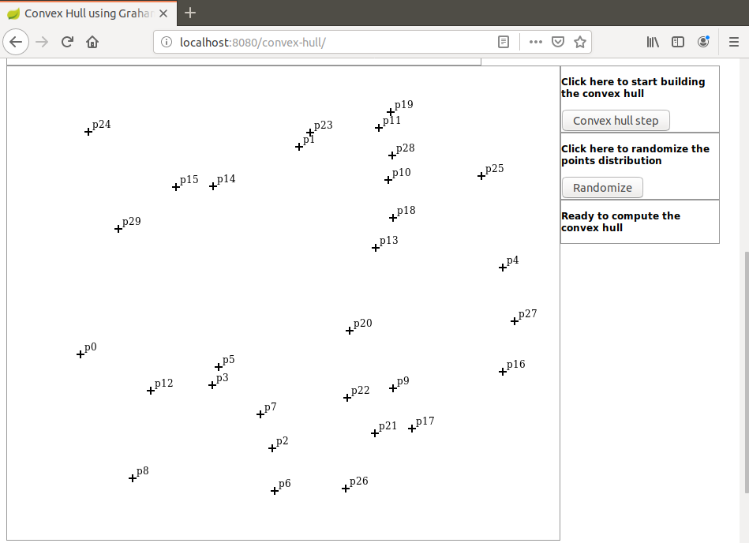
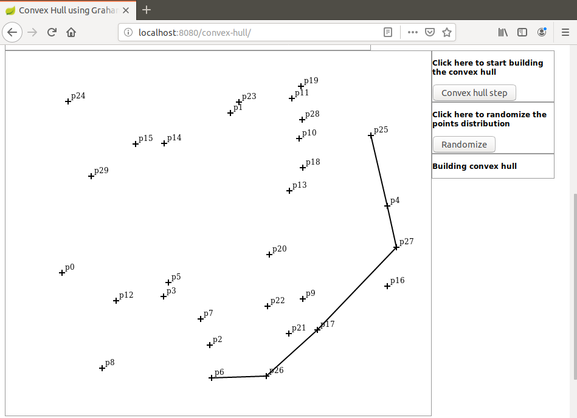

# graham-step

I present here a Java based demonstration of the Graham Scan algorithm that is used to find the convex hull of a random points distribution.

Javascript is used for display and initialization only. Here are the implementation details:

A random points distribution is created (browser side)

The distribution is sent to the server as a JSON object.

Then the Graham Scan is executed step-by-step (server side).

At each step the partial result is sent to the browser as a JSON object.

The partial result is used to update the display.

To launch the demo run the command `mvn spring-boot:run` in project directory.

When the application has started open a browser and hit URL `localhost:8080/convex-hull`.

Here are some screen shots that can be seen during the demo.

After the points distribution was initialized:

Graham step:

Dominique Ubersfeld, Cachan, France

